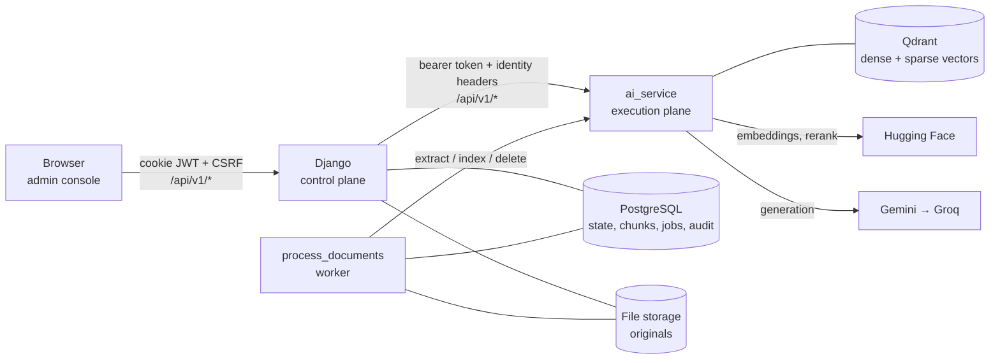
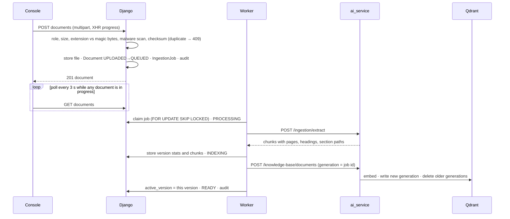

# Knowledge base and RAG — architecture

The admin console's knowledge base: documents in, cited answers out.
Three processes, each with one job.



| | Owns | Never does |
|---|---|---|
| **client** (`client/`) | Screens, forms, polling, streaming display | Hold a token or key; decide what a user may do |
| **Django** (`backend/apps/knowledge_base`) | Users' roles, workspaces, knowledge bases, documents, versions, chunks, files, the job queue, audit and query logs | Parse a file, embed, search, call a model |
| **ai_service** (`ai_service/`) | Parsing, cleaning, chunking, safe URL fetching, embeddings, Qdrant, hybrid retrieval, reranking, prompts, generation, citations, support level | Store anything; trust anything but Django's token |

## Data model

```
Workspace ─┬─ WorkspaceMembership (user, role: viewer | editor | admin)
           └─ KnowledgeBase (name, chat_enabled, default_language, status)
                └─ KnowledgeSource (file | url | text — future: website, notion, drive…)
                     └─ Document (title, status, stage, error, category, tags, language,
                          │        active_version → searchable, latest_version)
                          └─ DocumentVersion (file, checksum, format, stats, warnings,
                               │               embedding_model, index_generation)
                               └─ DocumentChunk (index, content, page(s), heading, section, tokens)
IngestionJob (kind, status, stage, attempts, heartbeat, run_after, payload, result)
RagQueryLog (outcome and timings — never the question text)
AuditLog (actor, action, target)
```

A **source** is where content comes from; a **document** is what it became.
New source types add a `SourceType` and an extractor call; the document,
version, chunk and index machinery is shared.

Only a document's **active version** is in the search index. A new version is
processed beside it and replaces it only once it is fully indexed; an older
version with a stored file can be made active again.

## Upload to searchable



A failure at any step sets `FAILED` with a code and a sentence a person can
act on (`This PDF is password-protected…`, `The page could not be reached…`).
Temporary failures — the AI service unreachable, a timeout — are retried with
backoff before that. One document failing never affects another: each is its
own job.

## A question

1. Django authenticates the user and resolves the **scope from the database**:
   one knowledge base the user can view (Test RAG, chat testing) or every
   chat-enabled knowledge base in their workspace (the chatbot).
2. It calls ai_service with the workspace id as the tenant header and the
   resolved knowledge-base ids as a filter. Nothing the browser sent is used
   as a tenant or a scope.
3. ai_service rewrites the question only if it depends on earlier turns, runs
   dense and keyword search concurrently — both filtered by tenant and
   knowledge base inside Qdrant — fuses them (RRF), reranks, builds a
   deduplicated context within a character budget, and asks the model to
   answer only from it, citing passages as `[n]`.
4. Citations are checked against the passages actually given; invented ones
   are removed from the answer and counted. The answer gets a **support
   level** from evidence, not from the model's opinion of itself:
   `SUPPORTED`, `PARTIALLY_SUPPORTED` or `INSUFFICIENT_CONTEXT`.
5. Chat streams over SSE, relayed by Django frame by frame. Test RAG returns
   the same answer with the full retrieval trace: the searched-for query, the
   filters, each stage's hits and scores, and timings. The model's reasoning
   is not requested, recorded or shown.

## Security model

| Threat | Defence |
|---|---|
| A user reads another workspace's content | Every object is loaded through `access.py`, which joins to the workspace the user belongs to; outside it, everything is 404. Qdrant filters always carry the tenant; the knowledge-base filter only narrows, and an empty list matches nothing. |
| The frontend is modified | Roles in the UI only hide buttons. Every endpoint checks the role on the server (`viewer < editor < admin`). |
| Direct calls to ai_service | Bearer token compared in constant time; identity headers believed only with it; `/rag/test` also needs the admin header Django sets. |
| Hostile files | Size, extension and magic-byte checks in Django; format re-detected from bytes in ai_service; limits on pages, characters, decompressed size and compression ratio (zip bombs), table rows and chunks; optional ClamAV (fails closed). Files stored outside any served path with random names; downloads are attachments with `nosniff` and a sandbox CSP. |
| SSRF through URL sources | Django refuses non-http(s), IP literals in private ranges and local names; ai_service resolves the name and requires every address to be public, connects to the vetted IP, re-validates each redirect, ignores environment proxies, caps size after decompression and allows only HTML/text. |
| Prompt injection from documents | Passages are framed as quoted data; the prompt says instructions inside them are content. Answers render as text — no HTML from the model is ever parsed — and only http(s) links are ever made clickable. |
| Leaks | Secrets only in server env. No stack traces in responses; errors are a code and a sentence. Logs never contain passwords, tokens, keys, file contents or question text. |
| Abuse | Per-user throttles on upload, sources, Test RAG and chat in Django; per-process limits in ai_service. |

Every change — upload, edit, reprocess, retry, cancel, delete, restore,
settings — is written to the audit log with its actor.

## Frontend

`client/src/components/console/` holds the console's primitives (buttons,
badges, dialogs on the native `<dialog>`, fields, tables, toasts, skeletons);
`components/knowledge-base/` the knowledge-base pieces; `pages/console/` the
routes under `/dashboard/knowledge-base`. No dependency was added: data
fetching is `useResource` (abortable, keeps data on screen during a reload),
polling is `usePolling` (stops in a hidden tab), uploads use XHR for
progress, and chat reads the SSE stream from `fetch`.

## Running and testing

See `backend/README.md` (Knowledge base) and `ai_service/README.md`
(§5 Running it). Tests:

```bash
cd backend && venv/Scripts/python manage.py test --settings=config.settings.test
cd ai_service && venv/Scripts/python -m pytest tests
cd client && npx tsc -b && npx vite build
```

Backend tests cover authorisation and isolation, uploads and validation, the
job queue and its failure paths, sources and SSRF refusals, RAG and chat
relaying, and the internal API. ai_service tests cover every parser (including
hostile files), cleaning, chunking, the URL fetcher, index generations,
filters, grounding and diagnostics. `ai_service/tests/evaluation/` measures
retrieval and answer quality against a labelled set.

## Known limitations

- **No OCR.** Scanned PDFs are refused with a reason rather than indexed empty.
- **Polling, not push.** Status updates arrive within three seconds; there is
  no socket layer.
- **Streaming under WSGI** holds a thread per open answer — run gunicorn with
  `--threads`, or ASGI, where chat volume matters.
- **ai_service rate limits are per process.** Django's throttles count in
  its cache — Redis when `REDIS_URL` is set, the database cache otherwise in
  production, per-process memory in development.
- **Malware scanning is off by default** (`KB_MALWARE_SCANNER=none`); enable
  ClamAV before accepting uploads from people you do not trust.
